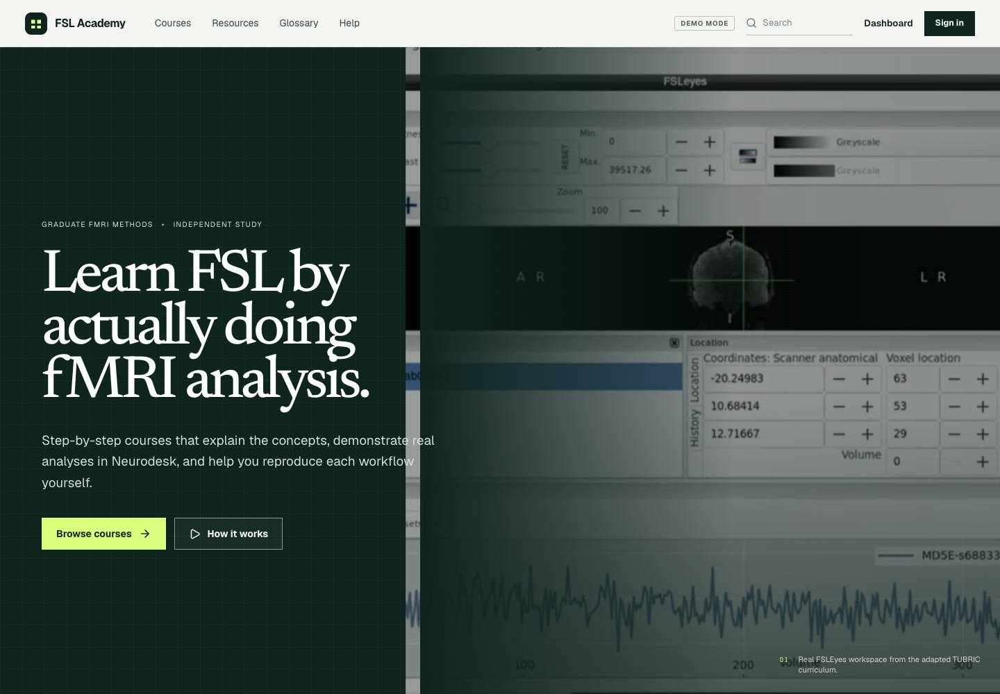
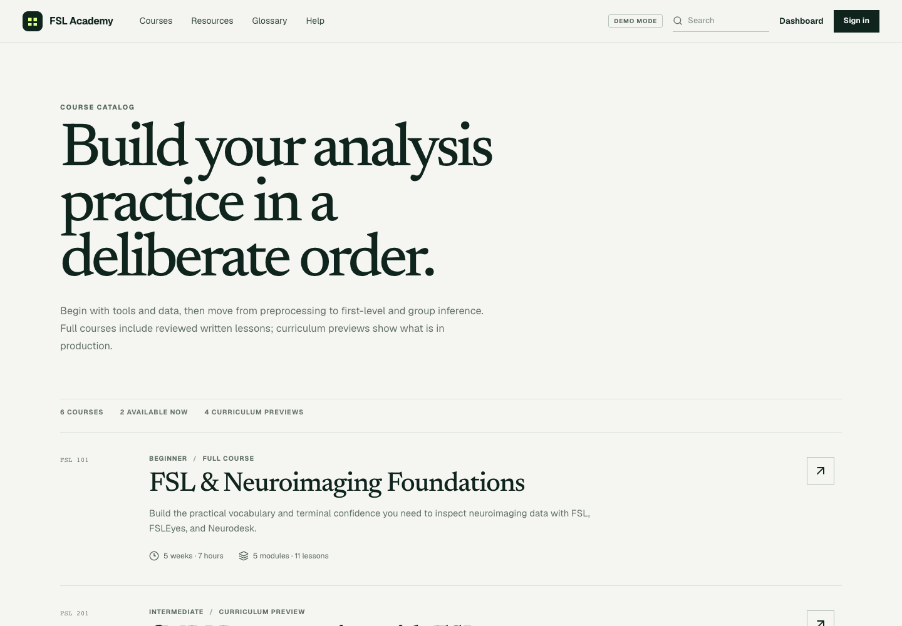

# Voxelwise Lab

Voxelwise Lab is a video-first, self-paced learning platform for graduate students and researchers learning functional MRI analysis with FSL. It connects clear conceptual teaching with authentic Neurodesk, FSLEyes, terminal, and FEAT workflows so learners can understand a method, see it performed, reproduce it, and evaluate the resulting evidence.

## Goals

- Make rigorous FSL and fMRI training accessible outside a live classroom.
- Build conceptual understanding before learners make decisions in analysis software.
- Connect statistical ideas to reproducible, step-by-step neuroimaging workflows.
- Teach learners to recognize expected outputs, diagnose common problems, and apply meaningful quality control.
- Develop confident researchers who can distinguish a completed computation from a scientifically defensible analysis.
- Support a progressive path from neuroimaging foundations through first-level modeling, group analysis, ROI methods, connectivity, and ICA.

